# Lixie StopWatch

An open-source, Wi-Fi-connected time-tracking device that combines retro
Lixie (pseudo-Nixie) tube aesthetics with modern IoT. Tap a touch screen,
pick a client / project / app, watch the LED digits count up, and submit
the session to a self-hosted backend with one tap. All clients, projects
and time logs live on a Flask + SQLite server you control; a React
dashboard gives you full CRUD, live status, reports and a remote-control
mirror of every device's screen.

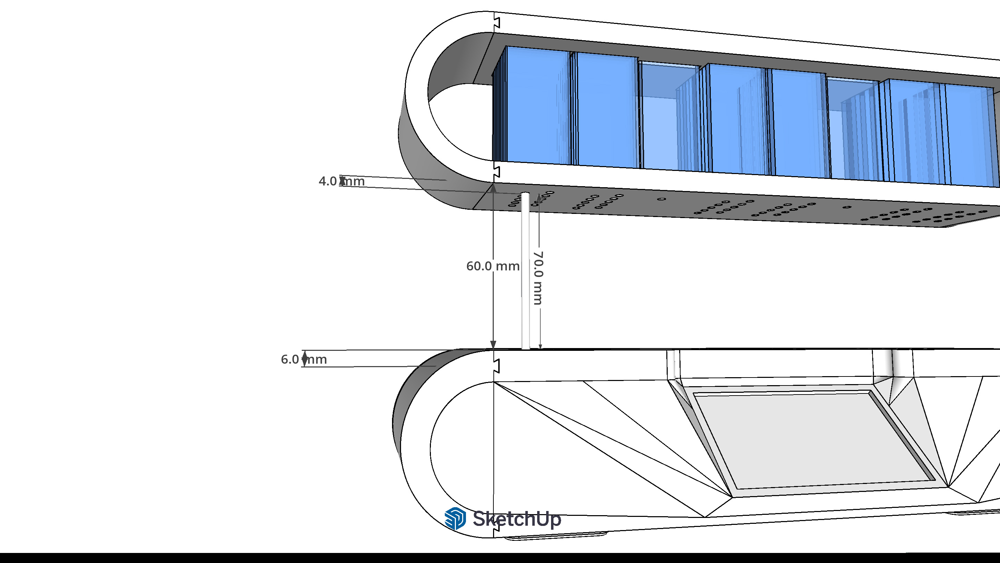

---

## What it does

* **6-digit Lixie display (HH:MM:SS)** — 75 WS2812B LEDs on 3× 5×5 boards,
  light shining through engraved cast-acrylic tiles to give a floating
  3-D digit effect.
* **Touch UI on a 3.2" Nextion display** — pick a client → project →
  optional app, then Start. Pause / Continue / Stop / Discard on screen.
* **Wi-Fi onboarding via captive portal** — no need to flash credentials
  into the firmware. Plug in a fresh device, it brings up
  `LixieStopWatch-Setup`, you join it from a phone and pick your home /
  office network from a list.
* **Self-hosted Flask backend + React dashboard** — clients, projects,
  pricing, time logs, devices and reports. Mobile-friendly UI works on
  phones too.
* **Live state over WebSocket** — the dashboard sees every device's
  running state within ~1 s and renders a per-second timer that drifts
  forward locally between server pushes.
* **Remote control mirror** — a faithful 400×240 React render of the
  device's screen; click anywhere on it to inject a touch as if you'd
  tapped the physical Nextion. Operate the unit blind from the dashboard.
* **Per-device LED settings** — clock colour, brightness, and an
  independent colour for the blinking colon dots, all editable from the
  dashboard and persisted in NVS on the device.
* **Weather + RSS news on the idle screen** — auto-derived from public
  IP, no API keys required.

---

## Project layout

```
nextion-stopwatch/     ESP32-S3 firmware (Arduino sketch + headers)
web-dashboard/
  backend/             Flask REST API + WebSocket hub + SQLite
  dashboard/           React + Vite + Tailwind admin SPA
3d/                    STL files for the case (print-ready)
dimensions/            Photos with measurements + assembly references
Lixie StopWatch — Build Estimate.xlsx
                       Per-unit BOM and time estimate (live formulas)
API.md                 REST + WebSocket reference
nextion-stopwatch/HMI_SETUP.md
                       Steps to build the minimal Nextion HMI file
install.sh             One-shot installer for the backend on a server
lixie-stopwatch.service
                       Systemd unit installed by install.sh
LICENSE                MIT
```

---

## Bill of materials — what one unit costs you

Slovak retail prices (techfun.sk + a hobby laser-cut service), mid-2026.
**Power supply, switch and heavy cabling are not included** because they
depend on how bright you run the LEDs (USB-C from the dev board is enough
at low/medium brightness; for full brightness on all 75 LEDs use a
separate 5 V / 5 A+ supply).

| Item | Qty | Unit | Total |
|---|---:|---:|---:|
| ESP32-S3 N16R8 dev board | 1 | 9.65 € | 9.65 € |
| Nextion 3.2" touch display | 1 | 49.20 € | 49.20 € |
| WS2812 5×5 RGB LED matrix board | 3 | 4.70 € | 14.10 € |
| Wires for connecting everything | 1 | 6.00 € | 6.00 € |
| 3 mm optical fibre, 5 m | 5 m | 0.75 €/m | 3.75 € |
| **Electronics subtotal** | | | **82.70 €** |
| Cast plexiglass sheet (3 mm) | 1 | 8.00 € | 8.00 € |
| Laser cutting + engraving (paid service, ~45 min) | 1 | 45.00 € | 45.00 € |
| **Optics subtotal** | | | **53.00 €** |

**3D-printed case — pick one:**

| Scenario | Detail | Cost |
|---|---|---:|
| A. You own a 3D printer | 500 g PETG + ~1.7 kWh (our reference: Prusa MK4s, 19 h 14 min) | 13.00 € |
| B. You pay a 3D-print service | 500 g PETG @ ~0.12 €/g | 60.00 € |

**Grand totals**

| Scenario | Total per unit |
|---|---:|
| **A — own 3D printer** | **148.70 €** |
| **B — paid print service** | **195.70 €** |
| A* — AliExpress route + own printer (3–5 week shipping wait) | 121.65 € |
| B* — AliExpress route + paid print | 168.65 € |

Full breakdown with live formulas, alternatives and assumptions:
[`Lixie StopWatch — Build Estimate.xlsx`](Lixie%20StopWatch%20%E2%80%94%20Build%20Estimate.xlsx).

### Tools / consumables you'll also need
Soldering iron, helping-hands stand, multimeter, USB-C cable, hot-glue or
super-glue for fibre seats, fine sandpaper for the laser-cut tiles.

---

## 3D-printable parts

All STL files are in [`3d/`](3d/). Print orientation, supports and
materials are noted below. Total filament for the full set: **≈ 500 g
PETG**, total print time **≈ 19 h 14 min on a Prusa MK4s** (0.2 mm layer
height, 15 % gyroid infill, no supports needed if you respect the
overhang directions below).

| File | What it is | Notes |
|---|---|---|
| `esp-top.stl` | Top shell of the electronics bay | Print right-side-up |
| `esp-back-wall.stl` | Rear wall with cable cut-outs | — |
| `esp-bootom-new.stl` | Main bottom plate of the electronics bay | — |
| `esp-bootom-left.stl` / `esp-bootom-right.stl` | Side plates | Print with the mounting boss down |
| `numbers-backwall.stl` | Back wall behind the digit matrices | Black PETG looks best |
| `glass-fullv2.stl` | Main front frame holding the engraved tiles | — |
| `glass-full-top-v2.stl` | Cap that closes the front frame from above | — |
| `glass-side2x.stl` | Side spacer × 2 (print twice) | — |
| `display-lixie-final2.stl` | Bezel for the Nextion touch panel | Tight fit — calibrate flow |
| `foot.stl` | Foot rest, print ×2 | — |

---

## Dimensions & assembly references

Pictures with measurements live in [`dimensions/`](dimensions/). They
show how everything fits together; numbers on them match the STLs above.

| Picture | What it shows |
|---|---|
|  | Assembled unit, front |
| 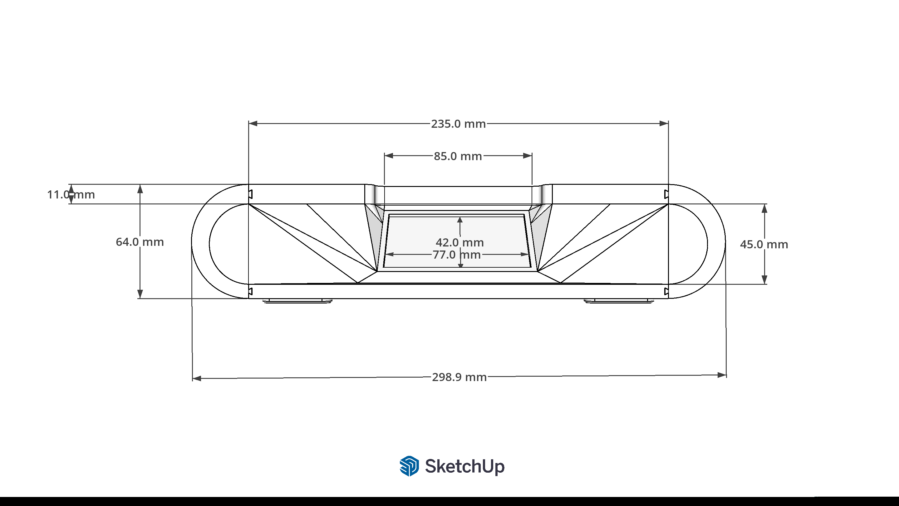 | Front-frame dimensions |
| 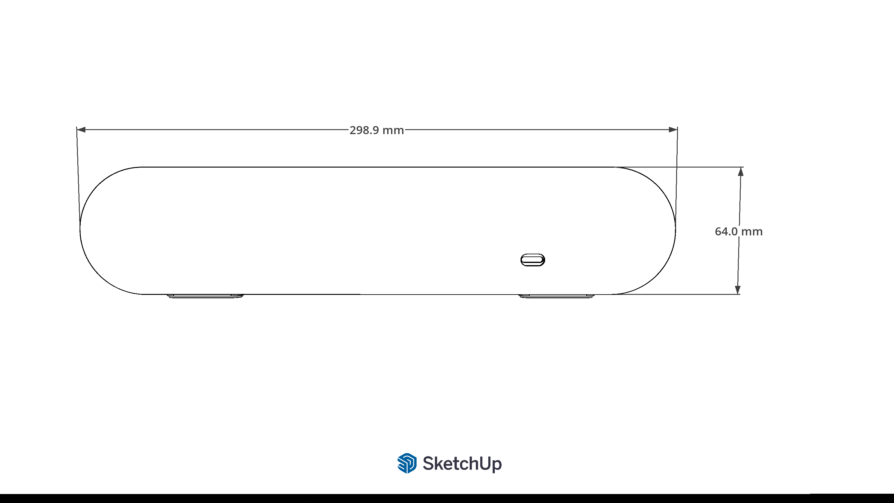 | Side profile |
| 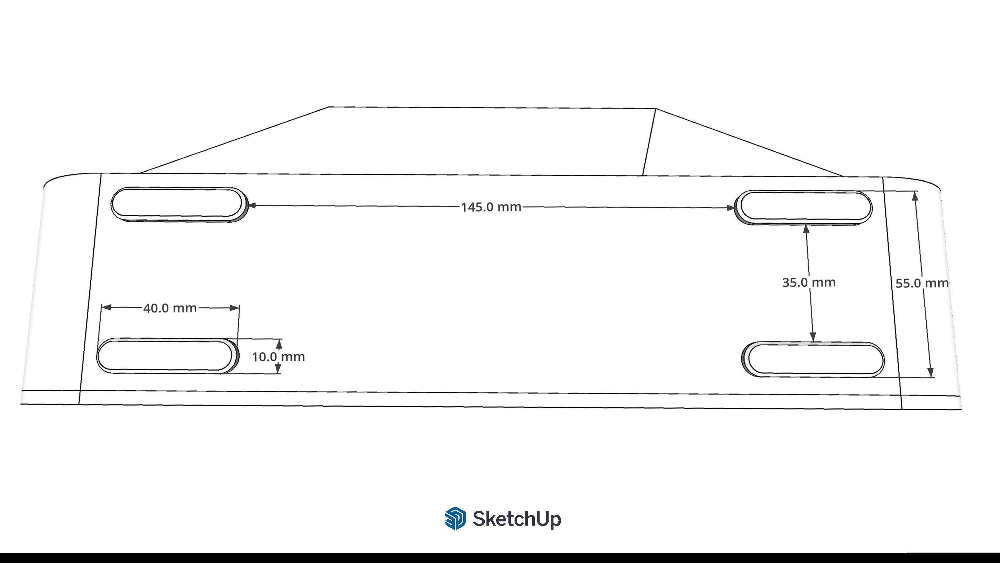 | Engraved tile stack-up |
| 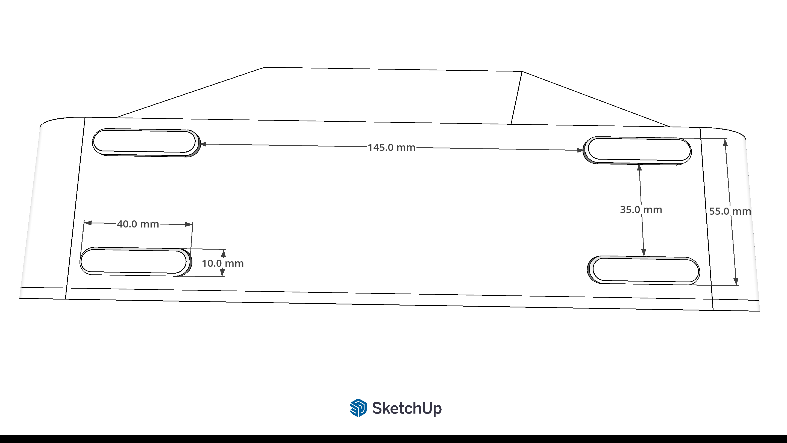 | Back-wall layout |
| 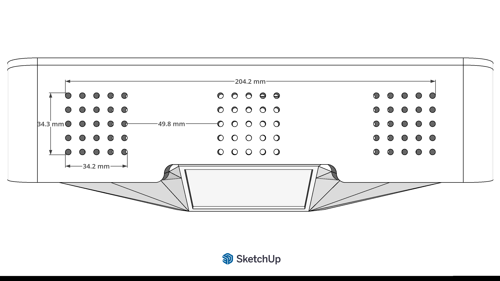 | Matrix-board placement grid |
| 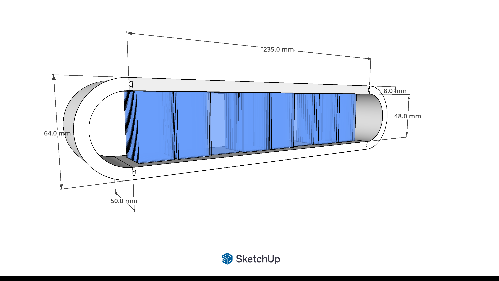 | Optical-fibre routing |
| 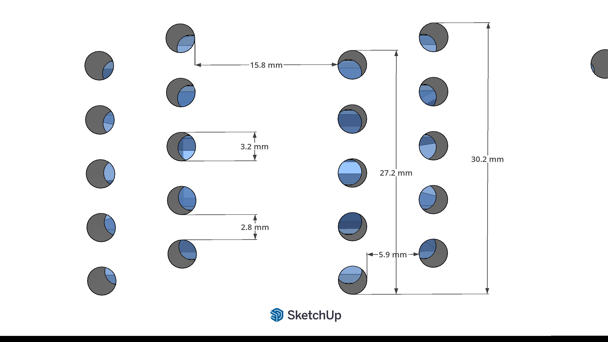 | Nextion bezel mounting |
| 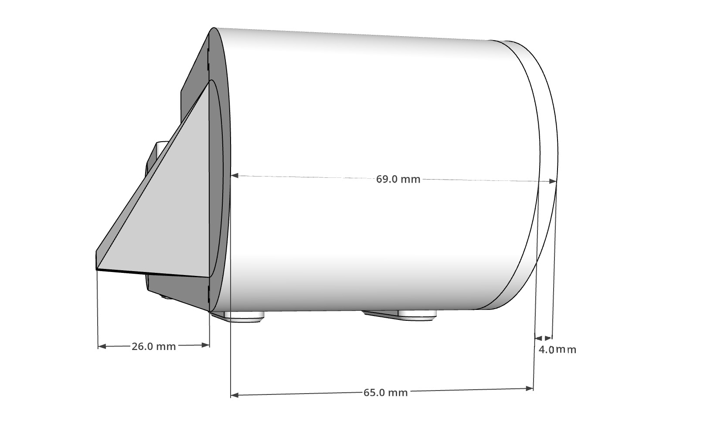 | Cable run for the LED chain |
| 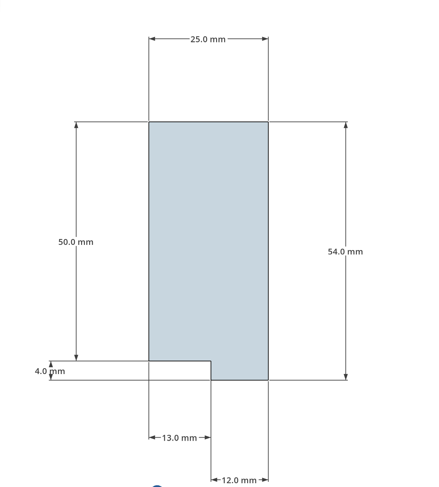 | ESP32 + Nextion wiring diagram |
| 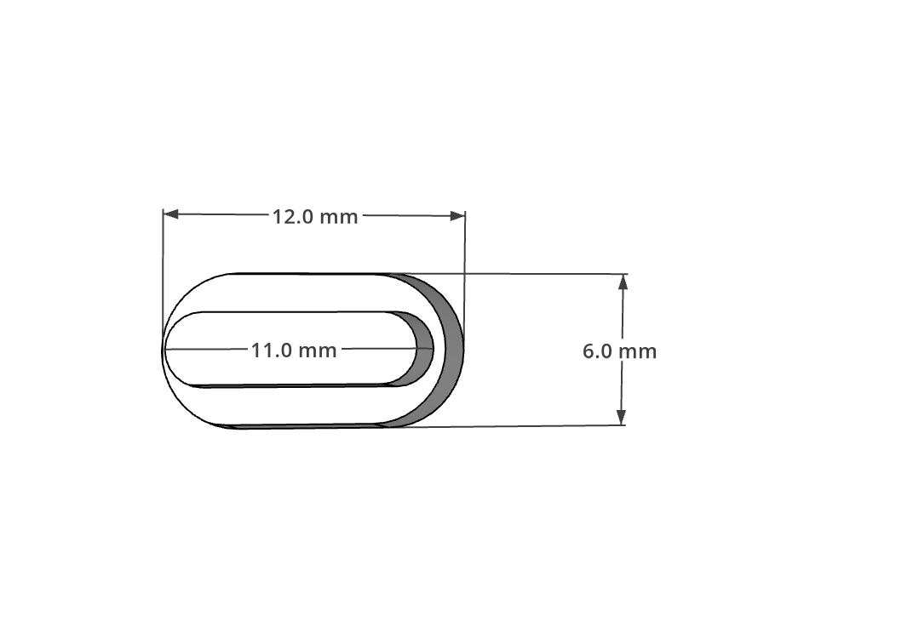 | Foot mounting |
| 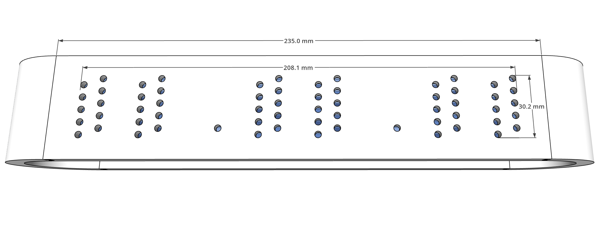 | Final exploded view |

---

## Build & assembly walk-through

1. **Print the case.** All 11 STLs from `3d/`. PETG is recommended near
   the power input; PLA is fine for the front frame.
2. **Cut 60 engraved tiles** — 10 layers of digits 0–9 per digit × 6
   digits — from 3 mm cast acrylic on a laser cutter. Vector source is
   embedded in the STL set; any hobby laser service can do this for you
   from the included engraving template.
3. **Solder the LED chain.** WS2812B 5×5 boards in series: DIN of board 1
   to GPIO 5, DOUT to DIN of board 2, etc. Insert each colon LED at the
   indices defined in `nextion-stopwatch/ledmap.cpp`.
4. **Wire the Nextion.** See [`nextion-stopwatch/HMI_SETUP.md`](nextion-stopwatch/HMI_SETUP.md)
   — it covers the pinout (GPIO 17/18 UART) and how to build the minimal
   HMI file from scratch.
5. **Slot the engraved tiles into the front frame** with optical fibres
   threaded from each LED to its tile. Refer to `dimensions/7.png` for
   the routing pattern.
6. **Close up the case**, plug in USB-C, and follow [First boot](#first-boot).

---

## Server installation (Linux, one-shot script)

The Flask backend + React dashboard live on any machine with Python 3.11+,
Node 18+ and a network reachable by the stopwatches. The included
[`install.sh`](install.sh) does everything for Debian/Ubuntu.

```bash
# On the server, as a normal user
unzip lixie-stopwatch-<version>.zip      # or git clone …
cd lixie-stopwatch
sudo bash install.sh
```

What the script does:

1. `apt install` Python venv tooling, Node + npm, build tools.
2. Creates a system user/group called **`lixie`**.
3. Copies the source tree to `/opt/lixie-stopwatch/`.
4. Creates a Python virtualenv at `/opt/lixie-stopwatch/venv/` and runs
   `pip install -r backend/requirements.txt`.
5. Runs `npm ci && npm run build` in the dashboard, copies the build
   into `backend/static/` so Flask serves the SPA on port 5000.
6. Installs `lixie-stopwatch.service` to `/etc/systemd/system/`, enables
   it and starts it.

When it finishes, the dashboard is reachable at `http://<server>:5000/`
and the API at `http://<server>:5000/api/v1/`. The database file lives
at `/opt/lixie-stopwatch/backend/instance/lixie.db` and is preserved on
re-runs of the script.

Re-run `sudo bash install.sh` after any code update to rebuild and
restart — the script is idempotent and the SQLite database in
`instance/` is excluded from the rsync.

### Verifying
```bash
systemctl status lixie-stopwatch.service
journalctl -u lixie-stopwatch.service -f
curl -s http://localhost:5000/api/v1/stats | python3 -m json.tool
```

### Reverse proxy / HTTPS
If you want HTTPS or a friendly hostname, point an Nginx / Caddy / Apache
vhost at `http://127.0.0.1:5000`. The WebSocket at `/api/v1/ws` upgrades
correctly through standard reverse-proxy WS configs — no extra path
gymnastics needed.

---

## Firmware install (ESP32-S3)

The firmware is a plain Arduino sketch in
[`nextion-stopwatch/`](nextion-stopwatch/).

1. Install **Arduino IDE 2.x**, add the **esp32 by Espressif Systems**
   board manager URL
   `https://espressif.github.io/arduino-esp32/package_esp32_index.json`
   and install the latest package.
2. Pick board **ESP32S3 Dev Module**, PSRAM **OPI PSRAM**, Flash size
   **16 MB**.
3. Install the libraries (Sketch ▸ Include Library ▸ Manage Libraries):
   - `FastLED`
   - `ArduinoJson` (v7)
   - `WebSockets` by Markus Sattler
4. Open `nextion-stopwatch/nextion-stopwatch.ino` and flash.

On a brand-new device the firmware tries the placeholder Wi-Fi in
`config.h` (`changeme` / `changeme`), fails, and brings up the captive
portal — keep reading.

---

## First boot

1. Power the device.
2. On a phone or laptop, join the open Wi-Fi **`LixieStopWatch-Setup`**.
3. A captive portal should open automatically — if not, browse to
   `http://192.168.4.1/`.
4. Pick your home / office Wi-Fi from the list, enter the password, hit
   **Save**. The device stores it to NVS and reboots.
5. From then on it auto-connects to that network at every boot. To
   change networks later, hold the front face during boot until you see
   the AP mode banner — or temporarily move it out of range of the saved
   network and it'll fall back to AP mode by itself.

Now go to the dashboard at `http://<your-server>:5000/`:

* **Devices** page shows your stopwatch as **Online** within ~5 seconds
  of the first WebSocket connect.
* Click the **palette** icon to set its clock + colon colours and
  brightness.
* Click the **mirror screen** icon to remote-control it from the
  browser.
* In **Clients** create your first client, then a project under it, and
  the device's selection menu populates instantly via REST.

---

## What you might want to change in the code

Out of the box the captive portal + the pre-configured RSS feed mean
**most people don't have to edit anything**. If you want to:

| What | Where |
|---|---|
| Server hostname / IP that the firmware talks to | `nextion-stopwatch/config.h` → `API_BASE_URL`, `WS_HOST` |
| Default LED brightness and colour | `nextion-stopwatch/config.h` → `LED_BRIGHTNESS`, `COL_ACCENT` (only used until the user overrides them from the dashboard) |
| Time zone | `config.h` → `TZ_STRING` (POSIX TZ syntax) |
| RSS news feed | `config.h` → `NEWS_RSS_URL` |
| Weather fallback city when ip-api.com geolocation fails | `config.h` → `WEATHER_FALLBACK_*` |
| Hardware ID (must be unique per physical unit if you have more than one) | `config.h` → `HARDWARE_ID` |
| LED-to-digit mapping if a segment is dark after soldering | `nextion-stopwatch/ledmap.cpp` → `ledIndex[][]` |
| Service paths / install root | `install.sh` and `lixie-stopwatch.service` |

---

## Power notes

* **USB-C only** — fine at low / medium brightness. The ESP32-S3 dev
  board's USB input can supply ~500 mA, enough for the display and the
  LEDs at brightness up to ~80/255.
* **External 5 V supply** — required if you want full brightness on all
  75 LEDs. Worst case draw is ~4.9 A (75 × 60 mA + the ESP32 and
  Nextion). A 5 V / 5 A+ switching supply is enough; wire it through
  your own switch and a fused barrel jack.
* Add a **1000 µF** electrolytic capacitor across the 5 V rail at the
  head of the LED chain if you see the first frame flash on power-on.

---

## License

[MIT](LICENSE). Use, copy, modify, fork, sell, do whatever you want —
just keep the copyright notice. The 3D models in [`3d/`](3d/) and the
Nextion HMI assets are released under the same terms.

---

## Credits

Built by the Lixie StopWatch team as an Erasmus+ school project (Erfurt
2026). Open-sourced so anyone can build, hack and improve.

Pull requests welcome — especially better case designs, alternative
display drivers, and translations of the dashboard UI.
